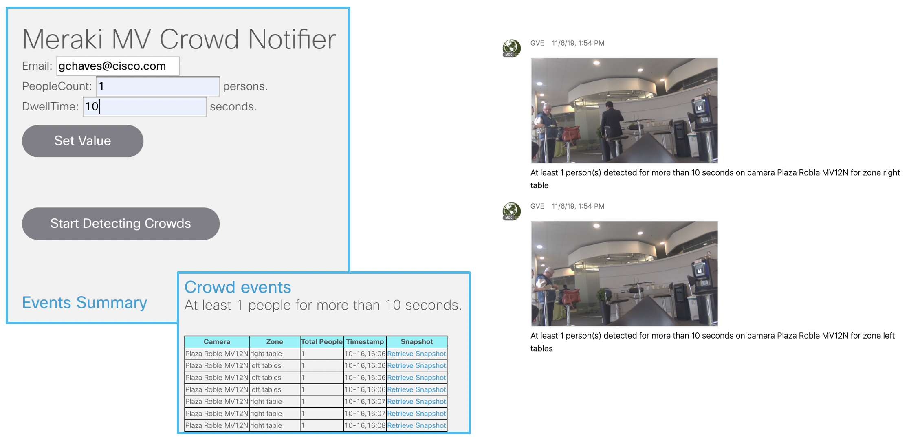

# Meraki MV Crowd notifier

This demo utilizes Meraki MV Sense camera data to detect when there are a number of persons in view of
the camera for at least a specified period of time (dwell time). Upon detecting an event,
it sends a message via Webex Teams to a user configurable recipient and resets a timer to start the process over.

It also implements web page that lists the crowd notification events with a URL to the video clip of when the crowds where detected.

## Configuration

**Config.py** contains all of the global variables and configuration needed throughout the code, including keys and thresholds.

### MV Sense Camera Setup  
Leverage Meraki new camera API and MQTT capability to create a notification service. When the camera detects a person consistently appears in a particular zone the service will send a Webex team message to a Webex team room with a video link which will directly go to the video footage when that even occurred. This is useful for alerting unexpected person movement in off-hours. Here is more information on MV sense data: https://developer.cisco.com/meraki/build/mv-sense-documentation/

—— MQTT and setting ——
1. In the Meraki dashboard, go to **Cameras > [Camera Name] > Settings > Sense** page.
2. Click **Add or edit MQTT Brokers > New MQTT Broker** and add you broker information. For testing/trial you can find public broker at [here](https://github.com/mqtt/mqtt.github.io/wiki/public_brokers).
3. You can install [MQTT.fx](https://mqttfx.jensd.de/) to subscribe to MQTT broker. This is a very useful tool

—— MV Sense Configuration ——
1. In the config.py file, there is a section for “variables utilized in mvSense.py” which contains all of the config variables for the MV Sense data gathering code
2. MQTT_SERVER is the MQTT broker ip or domain ("test.mosquitto.org" for example)
3. MQTT_PORT is the MQTT broker port being utilized (usually 1883)
4. MQTT_TOPIC is the top of the Meraki camera Matt, boy default it is “/merakimv/#”
5. MERAKI_API_KEY is the Meraki Api key for organization
6. NETWORK_ID is Camera's network ID, will use this get video link with camera api
7. COLLECT_CAMERAS_SERIAL_NUMBERS is the array of cameras serial numbers, for all of there cameras use *
8. COLLECT_ZONE_IDS is Array of camera zone id, all is *
9. MOTION_ALERT_ITERATE_COUNT is the minimum number of mqtt messages counted to indicate that an activity has successfully occurred
10. MOTION_ALERT_TRIGGER_PEOPLE_COUNT is the minimum number of people needed to successfully complete and activity
11. MOTION_PAUSE_TIME is the pause time after alert finished triggering
12. TIMEOUT is the number of messages until action times out due to in activity (will then check whether minimum alert iterate count is met to determine activity success)
13. BOT_ACCESS_TOKEN is the Webex Teams bot used to send the crowd notification messages

### Webex Teams Bot for sending notifications
You also need to have a Cisco Webex Teams Bot access token to configure in the config.py file. This way, the application
can send Webex Teams messages and snapshots from the cameras to any destination specified on behalf of that Bot and not have to
create an integration with a real user's credentials.
Here are instructions on how to obtain one: https://developer.webex.com/docs/bots

——------ Running Code ------—— 
1. Make sure Python is installed
2. Make sure pip is installed (https://pip.pypa.io/en/stable/installing/ for more information on pip)
3. Enter 'pip install -r requirements.txt' into command line to download necessary libraries
4. Ensure all elements of the config.py file are completed
5. To run the flask application, enter ‘python flaskApp.py’ in another terminal window and navigate your browser to the given url address (http://0.0.0.0:5001)
